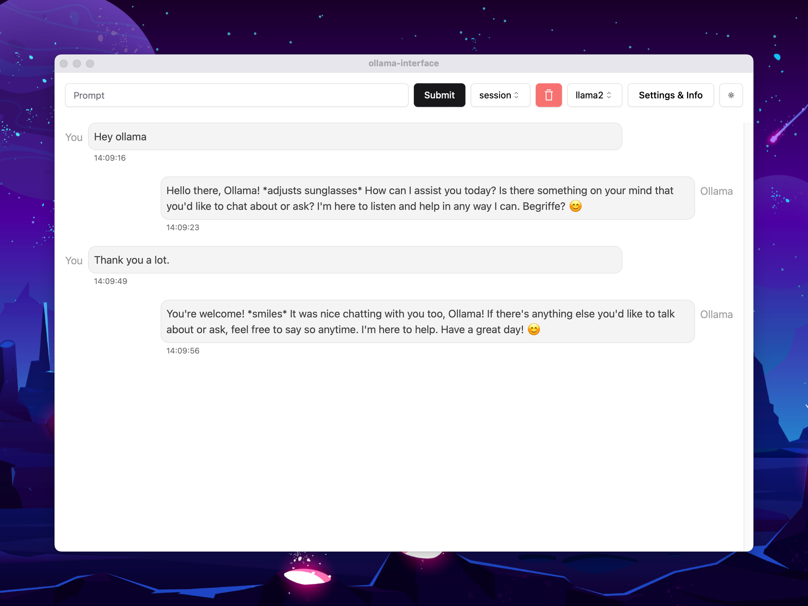

# Ollama GUI

Welcome to Ollama GUI, this is interface for ollama cli to make it easier to chat with, this also includes other features such as persisted conversation, switch between conversations and more.

 
 

## Create a build to fully self host it and offline use

### Requirements

- [Git](https://git-scm.com/)
- [NodeJS](https://nodejs.org/en)
- [pnpm](https://pnpm.io/)
- [rust](https://www.rust-lang.org/)

 

1.  Clone the repo `git clone git@github.com:ollama-interface/Ollama-Gui.git`
2.  `pnpm i`
3.  `pnpm build:app:silicon` (:silicon or :intell or :universal) depending on your machine
4.  Go to `/src-tauri/target/release/bundle/dmg/*.dmg` and install the program with the .dmg file.

 

You as well you need to install [Ollama](https://ollama.ai) and after you installed it, you can run your local server with this command `OLLAMA_ORIGINS=* OLLAMA_HOST=127.0.0.1:11435 ollama serve`.

 
 

This is not affiliated with Ollama.ai but just giving value to the community from me.
 

For any questions, please contact [Twan Luttik (Twitter - X)](twitter.com/twanluttik)
